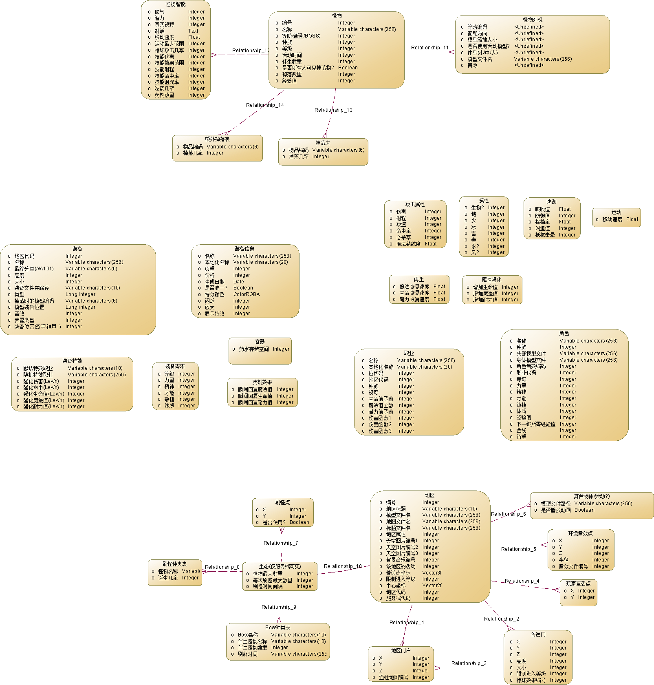

# 数据实体

定义并设计精灵中的各种数据实体，整体概念模型(设计中)如下：

## 核心实体

* 等级(等级/经验值)
* 攻击(攻击力/攻速/命中率/必杀率/射程/攻击方式/魔法熟练度)
* 防御(吸收/防御值/格挡率/闪避值/抗晕率)
* 元素抗性(地/火/雷/冰/毒)
* 移动速度
* 恢复(生命/魔法/耐力每秒恢复速度)
* 强化(直接增加生命值/魔法值/耐力值)

## 玩家/怪物/NPC

玩家、怪物和NPC在游戏中属于可以互动的物体，它们有一些公共实体。
### 外观

* 位置(坐标/朝向)
* 体型
* 模型
* 音效

### 玩家

* 等级(级别/经验值)
* 属性(力量/精神/才能/敏捷/体质)
* 职业(编号/种族)

### 怪物

* 人工智能(脾气/IQ/视野范围/攻击行为/防御行为/治疗行为/逃跑行为)
* 掉落物品
* 说话

### NPC

* 对话
* 售卖物品
* 特殊功能(锻造/合成/制作道具/镶嵌/奖励/仓库/技能大师/商城/兑奖..)

## 地区相关实体

* 地图模型
* 门户
* 传送门
* 复活点
* 刷怪点
* 刷怪(数量/种类/频率)
* 环境(天空/背景音乐/环境音效/互动物体) 

UPDATED by yan@2016/10/26