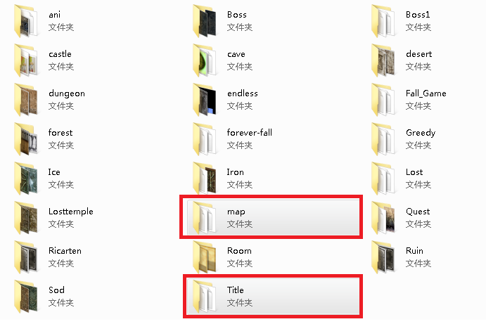
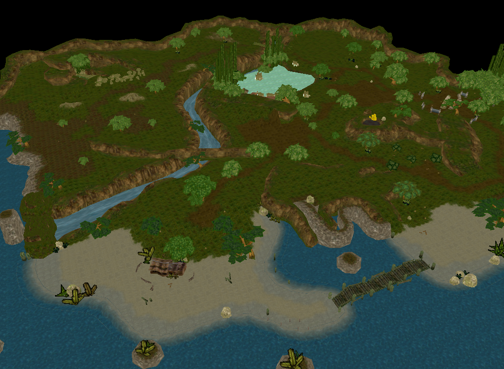
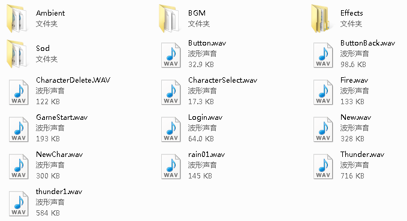
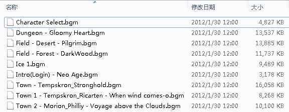
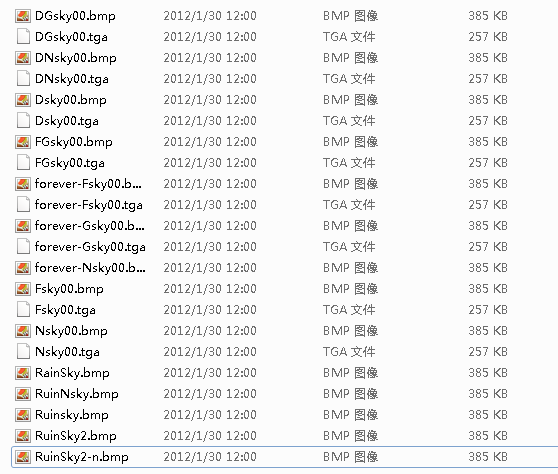
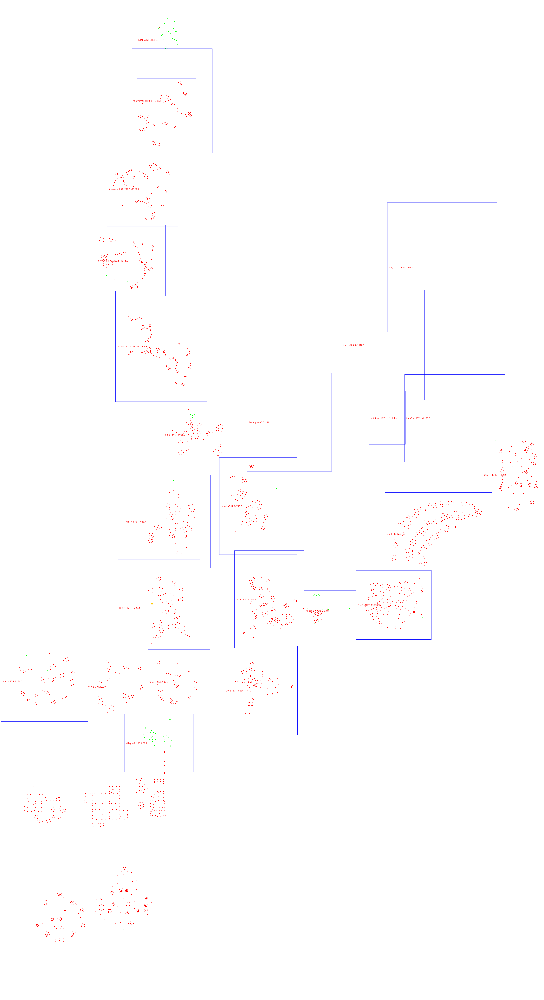
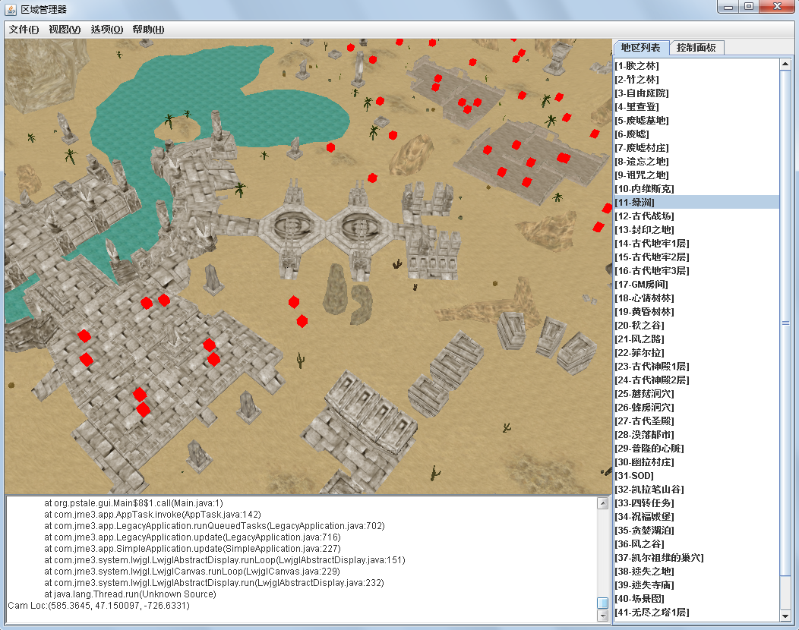

# FieldBox 刷怪点查看器

* 此项目用于视化编辑精灵地图数据。
* 可以添加/移除大地图。
* 可以添加/编辑/移除传送门。
* 可以编辑/预览服务器设置的地图刷怪点。
* 可以添加/移除地图中的NPC。
* 可视化查看服务器每个地图的范围和刷怪点。

# 客户端文件

每个地区的数据都由若干文件来存储，下面说明各种文件的存储路径及其用途。

## 模型文件
模型文件存储在客户端的Field文件夹中，主要保存了每个地图的3D模型。Field内的map文件夹和title文件夹分别存储了游戏内的小地图和标题图片。**这些图片均是加密过的tga文件，需要使用ImageDecoder工具进行解码。**

按道理来说，标题只需要存储为文字显示就好了，但是精灵将文字直接做成了图片。这样在翻译成不同语言版本时，直接替换对应的标题图片就可以了，不用修改程序。

	String FieldDirectory = "Field/"; //模型文件根目录
	String MapDirectory = "Field/map/"; // 小地图根目录
	String TitleDirectory = "Field/title/"; // 地图标题根目录

每个地区在游戏中都有一个唯一的代号，小地图的路径和标题路径可以根据这个代号按照固定的格式生成。

	Field/Map/%s.tga //小地图
	Field/Title/%st.tga // 标题

以胶之林(俗称森林3)这个地区为例，它在服务器中有个代号"fore-3"，它的模型、地图、标题图片存储可以用如下方式定义：

	"Title":"胶之林",
	"Name":"fore-3"
	"Model":"Field/forest/fore-3.ASE",
	"Map":"Field/map/fore-3.tga",
	"Title":"Field/title/fore-3t.tga",

每个地区都有一个主模型，包含了地表、建筑、植被等物件。同时每个地区中可能还会存在一些独立的物体，比如风车、传送门等。这些模型可能会带有简单的动画，诸如旋转、上下浮动等。它们都和主模型存储在同一个文件夹中。

下面是fore-3地区中的一些附属物件。Name字段标记了模型的文件路径；Animation字段标记了这个模型是否含有动画，1表示有动画，0表示没有。

	"StageObject": [
		{"Name":"forest/3ani-01.ASE", "Animation":0},
		{"Name":"forest/3ani-02.ASE", "Animation":0},
		{"Name":"forest/3ani-03.ASE", "Animation":0},
		{"Name":"forest/3ani-04.ASE", "Animation":0},
		{"Name":"forest/3ani-05.ASE", "Animation":0},
		{"Name":"forest/3ani-06.ASE", "Animation":0},
		{"Name":"forest/3ani-07.ASE", "Animation":0},
		{"Name":"forest/3ani-08.ASE", "Animation":0},
		{"Name":"forest/3ani-09.ASE", "Animation":0},
		{"Name":"forest/3ani-10.ASE", "Animation":0},
		{"Name":"forest/3ani-11.ASE", "Animation":0},
		{"Name":"forest/3ani-12.ASE", "Animation":0},
		{"Name":"forest/3ani-13.ASE", "Animation":0},
		{"Name":"forest/3ani-14.ASE", "Animation":0}
	],

## 音频文件

精灵的所有音频文件都是wav格式的，存储于游戏根目录的wav文件夹下。

### 背景音乐 BGM

每个场景都有一个对应的背景音乐，当玩家处于这个场景的时候，背景音乐会一直循环播放。背景音乐存储于BGM文件夹中，后缀名为bgm。

这些文件其实还是wav文件，只是后缀名稍微改了一下。将bgm改回wav就可以用任意播放器播放。

每个BGM在程序内都有一个代号，编码如下：

	#define BGM_CODE_CUSTOM		-1
	#define BGM_CODE_TOWN1		1
	#define BGM_CODE_TOWN2		2
	#define BGM_CODE_VILLAGE	3
	#define BGM_CODE_FOREST		4
	#define BGM_CODE_DUNGEON	5
	#define BGM_CODE_FILAI		6
	#define BGM_CODE_SOD1		7
	#define BGM_CODE_SOD2		8
	#define BGM_CODE_SOD3		9
	#define BGM_CODE_DESERT		10
	#define BGM_CODE_ICE		11

在Java程序中，我更倾向于使用枚举类型来表示它。而且wav文件的体积太大了，建议将wav文件转成ogg文件来使用。

	enum BGM {
		CUSTOM(-1, "自定义", "bgm/Field - Desert - Pilgrim.ogg"),
		TOWN1(  1, "内维斯克", "bgm/Town - Tempskron_Stronghold.ogg"),
		TOWN2(  2, "理查登", "bgm/Town 1 - Tempskron_Ricarten - When wind comes-o.ogg"),
		VILLAGE(3, "村庄", "bgm/wind loop.bgm"), // 这个文件并不存在
		FOREST( 4, "森林", "bgm/Field - Forest - DarkWood.ogg"),
		DUNGEON(5, "地下城", "bgm/Dungeon - Gloomy Heart.ogg"),
		FILAI(  6, "菲尔拉", "bgm/Town 2 - Morion_Philliy - Voyage above the Clouds.ogg"),
		SOD1(   7, "SOD1", "bgm/SOD_Stage_Play1.ogg"),
		SOD2(   8, "SOD2", "bgm/SOD_Stage_Play1.ogg"),
		SOD3(   9, "SOD3", "bgm/SOD_Stage_Play3.ogg"),
		DESERT(10, "沙漠", "bgm/Field - Desert - Pilgrim.ogg"),
		ICE(   11, "雪原", "bgm/Ice 1.ogg");
		LOGIN( 99, "登录", "bgm/Intro(Login) - Neo Age.ogg"),
		CHARACTER_SELECT(100, "角色选择", "Sounds/bgm/Character Select.ogg"),
	}

### 环境音效 Ambient

地图场景中还有一些特殊的环境音效，比如下雨声、下雪声、脚步声等。这些文件存储于wav/Ambient/文件夹中

这些环境音效定位于场景中的特殊点，并有影响半径。当玩家靠近这个点时，就会听到音效，比如篝火燃烧的声音。

环境音效的数据结构可以这样定义：

	"Ambient": [
		{"Position":[-1006, 170, -17835], "round":80, "AmbientNum":27},
		{"Position":[2632, 321, -17285], "round":80, "AmbientNum":27}
	],

Round是音效的影响半径，若Round=0，则说明这是一个非定位的音源，玩家总是能听到，比如下雨、打雷的音效。
AmbientNum是音频文件的索引号。

## 背景图片

精灵中的每个场景，至少有3个背景图片，分别用在白天、黑夜、黄昏场景中。当玩家在游戏中看向远处的时候，超出视野的部分就会被背景图片挡住。

实质上，在现代3D游戏中，这应该用天空贴图来代替。

场景的背景图片存储于根目录的sky文件夹内。

# 服务端文件

服务端文件主要存储了每个地区的生态、刷怪点、NPC等信息。

## 怪物数据
.spm文件存储了每个区域的刷怪上线、刷怪频率、怪物列表、BOSS列表等。

这是一个文本文件，可以用记事本编辑。它用韩文做标记，记录了各种数据。

## NPC
.spc文件存储了每个区域的NPC位置和种类。

这个是二进制文件，记录了每个NPC的位置坐标和面朝的方向。然后通过一个路径指向了实际存在的某个NPC定义文件。

一个场景中最多只能有个100个NPC，每个NPC有504字节，每个spc文件大小固定为50400字节。
数据结构如下：

	struct smTRNAS_PLAYERINFO
	{
		int	size;// 固定值，504，就是这个结构体的大小。
		int code;// 没有实际意义，标记了这个NPC信息是否有效。
	
		smCHAR_INFO	smCharInfo;
	
		DWORD	dwObjectSerial;
	
		int	x,y,z;// NPC在大地图上的坐标
		int ax,ay,az;// NPC的面向，记录绕xyz的旋转角度。这3个整数值应该是放了256倍之后的值。
		int state;
	};

smCHAR_INFO是另一个数据结构，存储了角色的模型、脚本、攻击、防御、回复、元素抗性等多种不同的属性。

## 刷怪点 StartPoint
.spp文件存储了每个地区的刷怪点数据。

这是个二进制文件，它记录了每个刷怪点在地图上的XY坐标，并用一个0/1值来标记是否启用该刷怪点。

每个地图最多只有200个刷怪点，每个刷怪点的数据由3个整数(共12字节)来存储，数据结构如下： 

	struct STG_START_POINT {
	  int state;
	  int x,z;
	};

state标记了这个点是否正在使用，0表示未使用，1表示使用。
x,z分别记录了刷怪点在大地图上的坐标。
 
由于刷怪点的数量和刷怪点数据结构是固定的，因此每个spp文件的大小也是固定的，共2400字节。

## JSON格式
通过对服务器数据的解读，我使用JSON格式来重新定义每个区域的数据结构。比如下面是fore-3的服务端数据：

	{
		"NPC":[
			{"Location":[-16503, 298, -6925], "Angle":[0, 5658, 0], "Script":"data/npc/tmcave-keeper.groovy"}, 
			{"Location":[-13783, 226, -8916], "Angle":[0, 5363, 0], "Script":"data/npc/acasia-store.groovy"}],
		"Creature":{
			"LimitMax":200,
			"OpenLimit":3,
			"OpenInterval":31,
			"MonsterList":[
				{"Name":"蘑菇精", "Percentage":12}, 
				{"Name":"魔兽兵", "Percentage":35}, 
				{"Name":"火精灵", "Percentage":10}, 
				{"Name":"绿木精", "Percentage":20}, 
				{"Name":"独眼魔人", "Percentage":3}, 
				{"Name":"双足虫", "Percentage":20}],
			"BossList":[
				{"Name":"超级木精怪", "Slave":"僵尸", "SlaveCnt":8, "OpenTime":[14, 18, 21, 23, 3]}]
		},
		"RespawnPoint":[[1, -10319,-10773], [1, -14100,-10584], [1, -10230,-10190], [1, -10583,-10874], [1, -10647,-10249], [1, -10414,-10086], [1, -10431,-9001], [1, -10602,-9193], [1, -10400,-9402], [1, -10135,-9148], [1, -12009,-9816], [1, -11636,-9754], [1, -11618,-9375], [1, -11985,-9512], [1, -10944,-7585], [1, -11049,-7244], [1, -11416,-7011], [1, -11323,-7315], [1, -11263,-7805], [1, -11641,-7597], [1, -13124,-10433], [1, -12901,-10261], [1, -12956,-10007], [1, -12653,-9915], [1, -14474,-9892], [1, -14476,-10215], [1, -14252,-10130], [1, -13471,-12141], [1, -13548,-11855], [1, -13801,-11978], [1, -13779,-11678], [1, -14166,-11655], [1, -14342,-11527], [1, -15052,-12184], [1, -15261,-12119], [1, -15267,-12349], [1, -15168,-13452], [1, -15299,-13222], [1, -12771,-12921], [1, -12975,-13058], [1, -13234,-13192], [1, -12855,-13296], [1, -12682,-13122], [1, -11191,-12353], [1, -11392,-12536], [1, -11696,-12649], [1, -16405,-12938], [1, -16166,-12805], [1, -16384,-12734], [1, -17131,-11962], [1, -16888,-12231], [1, -16889,-11821], [1, -16744,-11947], [1, -17273,-8896], [1, -16946,-9159], [1, -16965,-8894], [1, -16686,-9015], [1, -16214,-8745], [1, -15824,-8831], [1, -17461,-8495], [1, -13509,-6712], [1, -13139,-6766], [1, -13152,-6420], [1, -17135,-11693], [1, -13635,-9939], [1, -13395,-8451], [1, -13350,-8791], [1, -12920,-8141], [1, -13139,-8495], [1, -12684,-8453]]
	}

事实上，NPC的坐标和刷怪点坐标用JSON来存储还是太麻烦了，果然还是二进制好用一些。但是服务器刷怪的配置文件用JSON或YML存储都会跟直观一些。

最后来个全服刷怪点的预览图：

# 版本更新

## 0.1.0 版

* 实现了读取地图数据的功能
* 可以显示选择的地图，同时播放背景音乐
* 可以在地图上显示刷怪点(红色方块)
* 摄像机会自动定位到地图所在的区域

